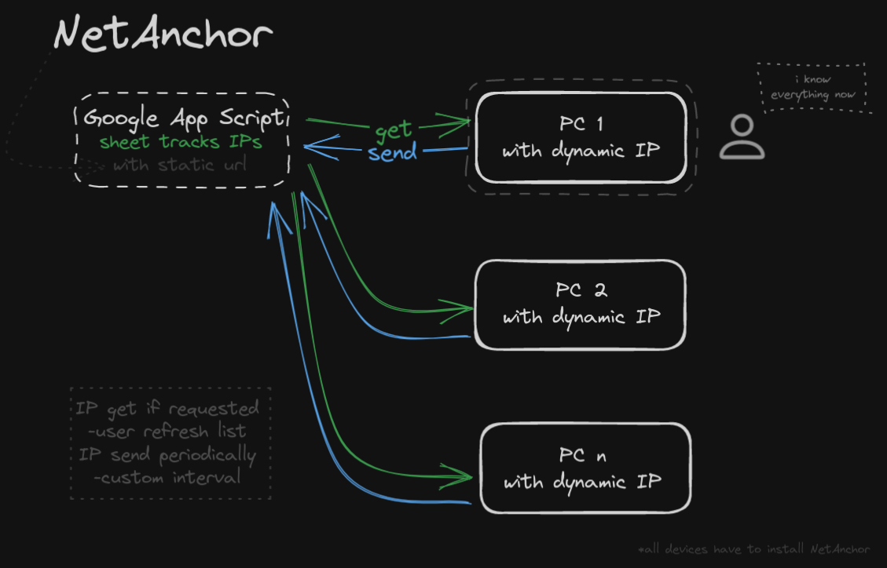

# NetAnchor

Keep track of dynamic IPs for all your connected devices, encrypted and private. 

## How it works

NetAnchor updates the IP table on Google Sheet using App Script, each device is responsible for sending its own IP, the PC you are operating on just reads the up-to-date Sheet.

## Instructions
- Install NetAnchor on the devices you want to track
- Login with Google 
- App Script permissions
- Enjoy!

## Suggested tools
- ipfy API is used for retrieving the IPs